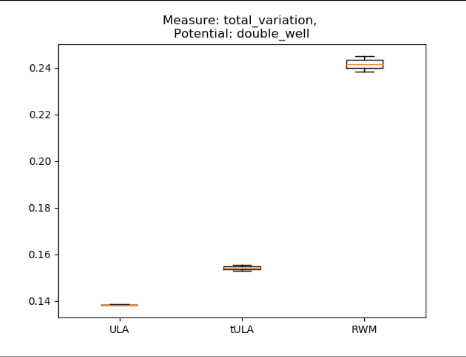

# LangevinMC

 #### An overview of Langevin Monte Carlo Algorithms
> Repository for MIGSAA (<http://www.maxwell.ac.uk/migsaa/people>) Taster Project 2
>
> Written by M. Puza, T. Hodgson, M. Holden, B. Han

#### Interactive visualization of LMC Algorithms
- <http://goatleaps.xyz/assets/ULA/ULA>

#### Report
- A full report on the topic can be find in this repository as a `pdf` file.

#### Implementation
 Implementation of the following LMC algorithms, together with various tools for
 analysis of their error can be found in this repository (`langevin.py`). References
 can be found in the report. The main purpose of our project is to estimate the errors
 made by all of these sampling methods.

 - ULA (Unadjusted Langevin Algorithm)
 - tULA/c ([Coordinatewise] Tamed Unadjusted Langevin Algorithm)
 - MALA (Metropolis-Adjusted Langevin Algorithm)
 - tMALA (Tamed Metropolis-Adjusted Langevin Algorithm)
 - tHOLA (Tamed Higher-Order Langevin Algorithm)
 - RWM (Random Walk Metropolis)
 - LM (Leimkuhler-Matthews method)
 - tLM (Tamed Leimkuhler-Matthews method)

# Documentation
Dependencies: `numpy, scipy, KDEpy, matplotlib, pickle` (To install missing dependencies `pip install KDEpy`, etc)

## Analysis

To perform analysis, first, create an Evaluator object.

```python
d = 1 # dimension
e = Evaluator(potential="double_well", dimension=d, x0=np.array([0]+[0]*(d-1)), burn_in=2, N=1000, N_sim=2, step=0.05, \
              N_chains=2, measuring_points=None, timer=None)
```

The available parameters are:
  - `potential`: currently one of 'gaussian', 'double_well', 'Ginzburg_Landau'.
  - `dimension`: integer.
  - `x0`: the starting point for the chains.
  - `burn_in`: integer, the first `burn_in` samples in each chain will be discarded.
  - `N`: integer, the number of samples in each chain.
  - `N_sim`: integer, the number of simulations.
  - `step`: float, the step size.
  - `N_chains`: integer, the number of chains to be run in each simulation.
  - `measuring_points`: for thinning the chain. When omitted, all of the samples from a chain will be preserved. Otherwise describes the indices of the samples to preserve from each chain (*after burn_in*). For example, setting this to [9, 10], with `burn_in=5` and `N_chains=10` will result in running 10 chains, taking from each the 15th and 16th (Python is zero-indexed) sample.
  - `timer`: float; rather than a fixed number of samples in each chain, one may choose to allocate to each chain a *fixed computing time*. This parameter sets the computing time in seconds.

Next, you may perform analysis in a single line.

``` python
e.analysis(algorithms=["ULA", "tULA", "RWM"], measure='total_variation', bins=40)
```

The parameters here are:
  - `algorithms`: a subset of ['ULA', 'tULA', 'tULAc', 'MALA', 'tMALA', 'RWM', 'LM', 'tHOLA', 'tLM', 'tLMc']
  - `measure`: a measure of choice. These are described below.
  - `bins`: the number of bins in each dimension (for histogram-based measures).

and the result is:



When running analysis, however, the numerical results are not stored. To store the numerical results, one may run an experiment.

``` python
  exp_name = 'Experiments/my_little_experiment'
  e.run_experiment(file_path=exp_name, algorithm='ULA', measure='total_variation', bins=10)
```

This saves the experiment results to file linked in `exp_name`. One may read the experiment results in the future with the following piece of code:

``` Python
my_little_experiment = pickle.load(open( exp_name, 'rb' ))
for k, v in my_little_experiment.items():
   print(k, ':', v)
```

which will print:

```
algorithm : ULA
measure : total_variation
bins : 10
potential : double_well
dimension : 3
x0 : [0 0 0]
step : 0.05
N : 1000
burn_in : 2
N_sim : 2
timer : None
N_chains : 2
results : [[0.2543805177875392, 0.2345092390242109]]
 ```

## Measures of error (parameter `measure`)
Closer description of the measures can be found in the report.

- Trace (`trace`)
     - *Note*: Assumes d = 2. Produces a trace plot.


- Histogram (`histogram`)
    - *Note*: Assumes d = 1. Produces a histogram plot.


- First moment (`first_moment`)
  - *Note*: In higher dimensions, the first moment in *the first coordinate* only is displayed.


- Second moment (`second_moment`)
  - *Note*: In higher dimensions, the first moment in *the first coordinate* only is displayed.


- KL Divergence (`KL_divergence`):
     - *Note*: Computes the KL divergence on *discrete histograms*.
     - *Note*: Make sure that bins^d <= ~10^6.


- Total Variation (`total_variation`):
    - *Note*: Computes the total variation on *discrete histograms*.
    - *Note*: Make sure that bins^d <= ~10^6.


- (1-)Sliced Wasserstein distance on histograms (`sliced_wasserstein`):
    - *Note*: Computes the SW distance on *discrete histograms*.
    - *Note*: Make sure that bins^d <= ~10^6.


- Naive (1-)Sliced Wasserstein approximation (`sliced_wasserstein`):
    - *Note*: Works for very large dimensions.
    - *Note*: Naively estimates the SW distance *only at the points where the samples were made*.
    - *Note*: If the sampled values are entirely wrong, this method will not work >> use first moment test first.


- Kernel Density Estimated (KDE) KL Divergence (`FFTKDE_KL`):
    - *Note*: Same as KL Divergence, uses *KDE instead of histograms*.


- KDE Total Variation (`FFTKDE_TV`):
    - *Note*: Same as Total Variation, uses *KDE instead of histograms*.


- KDE (1-)Sliced Wasserstein distance (`FFTKDE_SW`):
    - *Note*: Same as Sliced Wasserstein, uses *KDE instead of histograms*.
